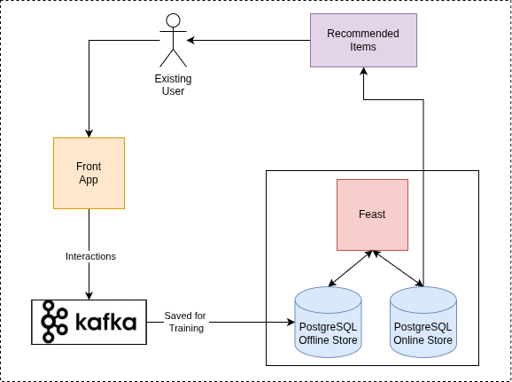

# Retail Recommendation System Demo
## Introduction
This deployment is based on the validated pattern framework, utilizing GitOps for seamless provisioning of all operators and applications. It deploys a Retail Recommendation System that leverages two-towe algorithm training technich to provide personalized item suggestions to customers, enhancing store sales by considering their preferences and demographics.

The pattern harnesses Red Hat OpenShift AI to deploy and serve recommendation at scale. It integrates the Feast Feature Store for feature management, EDB Postgres to store user and item embeddings, and a simple user interface (UI) to facilitate customer interactions with the system. Running on Red Hat OpenShift, this demo showcases a scalable, enterprise-ready solution for retail recommendations.
## Pre-requisites

- Podman
- Red Hat Openshift cluster running in AWS. Supported regions are : us-east-1 us-east-2 us-west-1 us-west-2 ca-central-1 sa-east-1 eu-west-1 eu-west-2 eu-west-3 eu-central-1 eu-north-1 ap-northeast-1 ap-northeast-2 ap-northeast-3 ap-southeast-1 ap-southeast-2 ap-south-1.
- GPU Node to run Hugging Face Text Generation Inference server on Red Hat OpenShift cluster.
- Create a fork of the <TODO add link for the repo after moving it to VP project> git repository.

## Demo Description & Architecture
### Key Features
* UI: Allows users to browse recommendations, add items to cart, purchase, or rate products.
* Feast Feature Store: Manages and serves features for training and real-time inference.
* EDB Postgres with PGVector: Stores user and item embeddings, enabling fast similarity searches.
* Kafka Integration: Records user interactions for continuous learning and dataset updates.
* Red Hat OpenShift AI
* Two-Tower Architecture: Utilizes separate neural networks to generate user and item embeddings for personalized recommendations.
<!-- * Monitoring Dashboard: Provides performance metrics using Prometheus and Grafana.
* GitOps Deployment: Ensures an end-to-end, reproducible setup of the demo. -->

### Serving


Users can interact with the user interface to view items, add items to their cart, make purchases, or submit reviews.

Each user interaction is sent to a Kafka queue to be saved for training. Since we use a batch recommendation system, the suggested items are already computed during training, and we only need to perform a get operation on the dataset to retrieve the user’s suggestions.

### Workflow

The workflow consists of the following steps:

1. Data Ingestion
* Data originates from parquet files containing users, items, and interactions.
* Feast scans feature definitions, validates them, and syncs metadata to its registry.

2. Training - using the Two-Tower algorithm:


We have two encoders:
* User Tower: Encodes user features (age, gender, preference, ...) into embedding.
* Item Tower: Encodes item features (category, price, ...) into embedding.
  
For each interaction, positive or negative, train the encoders in such a way that positive interactions bring the item and the user closer in cosine similarity in the embedding space, and negative interactions move the user and the item embeddings farther apart.

3. Batch Scoring & Materialization


* Generates embeddings for all users and items using trained encoders.
* Computes the latest feature values and precomputes top-k recommendations for each user.
* Stores results in the online store for fast retrieval.

### Components Deployed
* Recommendation UI: A simple web application for users to interact with recommendations.
* Kafka & Kafka connect: ingest user interaction with items from the ui and sent them to Kafka, kafka connect move this intercation events into a EDB database.
* Feast Feature Store: Manages feature definitions and serves data for training and inference.
* EDB Postgres with PGVector: Acts as online (real-time embeddings) stores.
* Kubeflow job: A batch job that train the user and item encoders, then genrate the data generates embeddings into the vector database.

## Deploying the demo

To run the demo, ensure the Podman is running on your machine.Fork the [rec-sys-gitops](https://github.com/validatedpatterns/rec-sys-gitops) repo into your organization

### Login to OpenShift cluster

Replace the token and the api server url in the command below to login to the OpenShift cluster.

```sh
oc login --token=<token> --server=<api_server_url> # login to Openshift cluster
```

### Cloning repository

```sh
git clone https://github.com/<<your-username>>/rec-sys-gitops.git
cd rec-sys-gitops
```

<!-- ### Configuring model

This pattern deploys [IBM Granite 3.1-8B-Instruct](https://huggingface.co/ibm-granite/granite-3.1-8b-instruct) out of box. Run the following command to configure vault with the model Id.

```sh
# Copy values-secret.yaml.template to ~/values-secret-rag-llm-gitops.yaml.
# You should never check-in these files
# Add secrets to the values-secret.yaml that needs to be added to the vault.
cp values-secret.yaml.template ~/values-secret-rag-llm-gitops.yaml
```

To deploy a model that can requires an Hugging Face token, grab the [Hugging Face token](https://huggingface.co/settings/tokens) and accept the terms and conditions on the model page. Edit ~/values-secret-rag-llm-gitops.yaml to replace the `model Id` and the `Hugging Face` token.

```sh
secrets:
  - name: hfmodel
    fields:
    - name: hftoken
      value: null
    - name: modelId
      value: "ibm-granite/granite-3.1-8b-instruct"
  - name: minio
    fields:
    - name: MINIO_ROOT_USER
      value: minio
    - name: MINIO_ROOT_PASSWORD
      value: null
      onMissingValue: generate
``` -->

<!-- ### Provision GPU MachineSet

As a pre-requisite to deploy the application using the validated pattern, GPU nodes should be provisioned along with Node Feature Discovery Operator and NVIDIA GPU operator. To provision GPU Nodes

Following command will take about 5-10 minutes.

```sh
./pattern.sh make create-gpu-machineset
```

Wait till the nodes are provisioned and running.


Alternatiely, follow the [instructions](./GPU_provisioning.md) to manually install GPU nodes, Node Feature Discovery Operator and NVIDIA GPU operator. -->

<!-- ### Deploy application

***Note:**: This pattern supports two types of vector databases, EDB Postgres for Kubernetes and Redis. By default the pattern will deploy EDB Postgres for Kubernetes as a vector DB. To deploy Redis, change the global.db.type to REDIS in [values-global.yaml](./values-global.yaml).

```yaml
---
global:
  pattern: rag-llm-gitops
  options:
    useCSV: false
    syncPolicy: Automatic
    installPlanApproval: Automatic
# Possible value for db.type = [REDIS, EDB]
  db:
    index: docs
    type: EDB  # <--- Default is EDB, Change the db type to REDIS for Redis deployment
main:
  clusterGroupName: hub
  multiSourceConfig:
    enabled: true
``` -->

Following commands will take about 15-20 minutes

### Deploying the pattern

```sh
./pattern.sh make install
```

### 1: Verify the installation

- Login to the OpenShift web console.
- Navigate to the Workloads --> Pods.
- Select the `rec-sys` project from the drop down.
- Following pods should be up and running.

<TODO>


### 2: Launch the application

<TODO>

### 3: Run the training workflow
<TODO>

### 4: Use the UI to get recommendations
<TODO>

## Licenses

EDB Postgres for Kubernetes is distributed under the EDB Limited Usage License
Agreement, available at [enterprisedb.com/limited-use-license](https://www.enterprisedb.com/limited-use-license).

